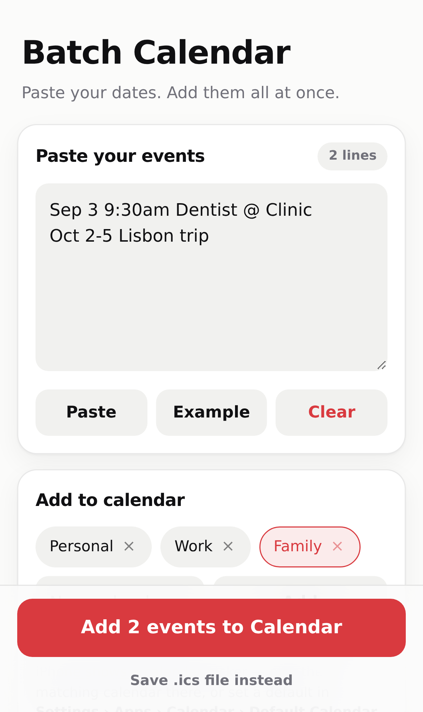

# Batch Calendar

A small PWA for iPhone. Paste a list of dates and event names into one box, check
what it understood, and add the whole lot to your calendar in one go.

No account, no server, no tracking — everything happens on the phone, and the app
works offline once it has been added to the Home Screen.



## Install it on your iPhone

1. Open the site in **Safari** (it must be Safari — Chrome on iOS cannot install web apps).
2. Tap the **Share** button, then **Add to Home Screen**.
3. Open it from the Home Screen. It runs full screen and works with no signal.

## Using it

1. **Paste your events** — one per line. Anything the app cannot read is listed
   separately so nothing disappears quietly.
2. **Pick a calendar** — the name you choose labels the batch. Add your own names
   with the field underneath; they are remembered.
3. **Check the preview** — tap any event to fix the title, dates, times, location
   or notes, or to remove it. Your corrections stick even if you keep typing in
   the paste box.
4. **Add to Calendar** — iPhone opens the share sheet. Choose **Calendar**, then
   **Add All**, and pick the calendar to file them under.

If iPhone drops events into the wrong calendar, set the one you want under
**Settings › Apps › Calendar › Default Calendar**, or add one batch per calendar.

### Lines it understands

| You type | It reads |
| --- | --- |
| `Sep 3 9:30am Dentist` | 3 September, 09:30–10:30 |
| `2026-11-01 19:00-22:00 Dinner` | 1 November, 19:00–22:00 |
| `12/09 School run` | 12 September (or 9 December — see Options) |
| `Oct 2-5 Lisbon trip` | four-day all-day event |
| `Dec 28 - Jan 3 Holiday` | rolls into the next year |
| `Nov 14 all day Marathon` | all-day event |
| `Sep 3 9-5 Workshop` | 09:00–17:00 |
| `Sep 3 Coffee @ Blue Bottle` | location: Blue Bottle |
| `Sep 3 Review // bring notes` | notes: bring notes |
| `2026-09-01<tab>Kickoff<tab>10am` | pasted straight from a spreadsheet |

Dates written `3/4` are ambiguous, so **Options** decides whether they are read
month-first or day-first (it starts on whichever suits your phone's language).
Dotted dates like `1.9.2026` are always read day-first. A date with no year that
has already passed rolls forward to next year; you can switch that off.

Options also set the start time and length used when a line has no time, and can
attach an alert to every event in the batch.

## How events reach the calendar

iOS gives web apps no direct access to Calendar, so the app builds a standard
[iCalendar](https://datatracker.ietf.org/doc/html/rfc5545) (`.ics`) file and hands
it to the share sheet — the same file format Calendar imports from Mail. Times are
written as local ("floating") times, so 3pm stays 3pm wherever you are.

## Updates

A service worker caches the app so it opens instantly and offline. It checks for a
new build on launch, whenever the app comes back to the front, and hourly while
open. When one is waiting, a banner offers **Update**; the new version only takes
over when you tap it. The footer shows the running version.

To ship a new build, bump `VERSION` in [`sw.js`](sw.js) — that is what invalidates
the cache and triggers the banner.

## Development

Everything is static: no build step, no dependencies at runtime.

```sh
npx http-server . -p 8080      # or any static server
npm test                       # parser and .ics unit tests (node --test)
npm run ui                     # end-to-end pass in Chromium, writes screenshots
npm run icons                  # re-render the PNG icons from icons/icon.svg
```

`npm run ui` and `npm run icons` need Playwright's Chromium (`npx playwright install chromium`).

| File | What it does |
| --- | --- |
| `assets/parser.js` | turns each pasted line into an event |
| `assets/ics.js` | builds the `.ics` file |
| `assets/app.js` | state, rendering, sharing, update banner |
| `sw.js` | offline cache and update channel |

## Publishing

The `main` branch is the site. In **Settings › Pages**, set the source to
*Deploy from a branch* → `main` / `/ (root)`. GitHub Pages serves it over HTTPS,
which is what service workers and the share sheet need.
